# Cloud Management

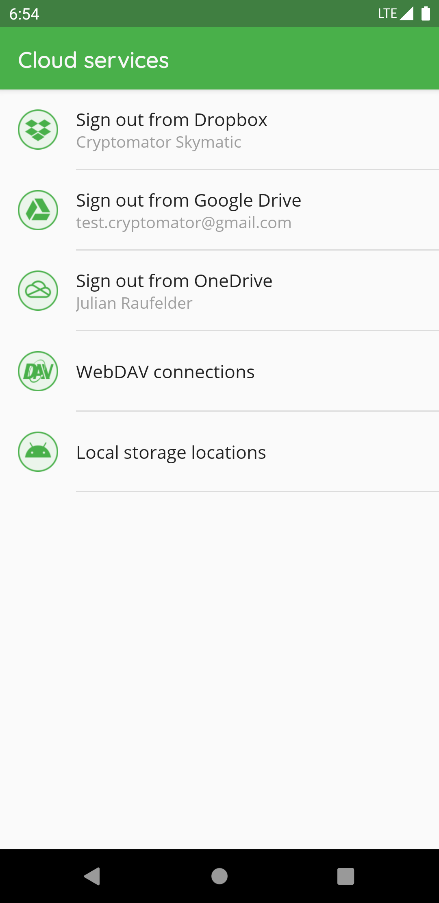

In "Cloud Services", you can create or edit the connection between the Cryptomator app and your storage provider accounts.

Please enter the credentials for your provider account or in case of Google Drive choose your account.
If your authentication was successful, some of the providers might ask you to grant Cryptomator access permission to your online files.
Please allow this permission.

In Google Drive, OneDrive and Dropbox you can only create one connection between your Cloud Service account and the Cryptomator app.
You can't connect to (for example) two different *Dropbox* accounts.

If the provider requested permission to access your online files you can remove Cryptomator permissions from your online storage account at any time.
Please keep in mind that Cryptomator then cannot connect to your vault anymore.

## Login Dropbox

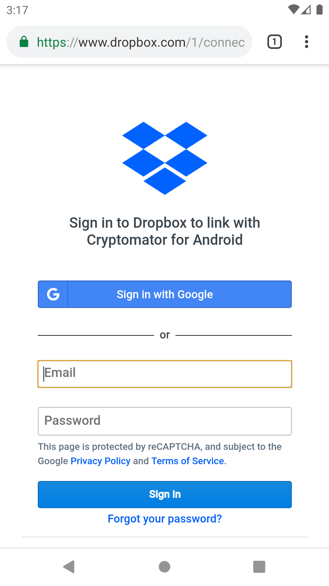

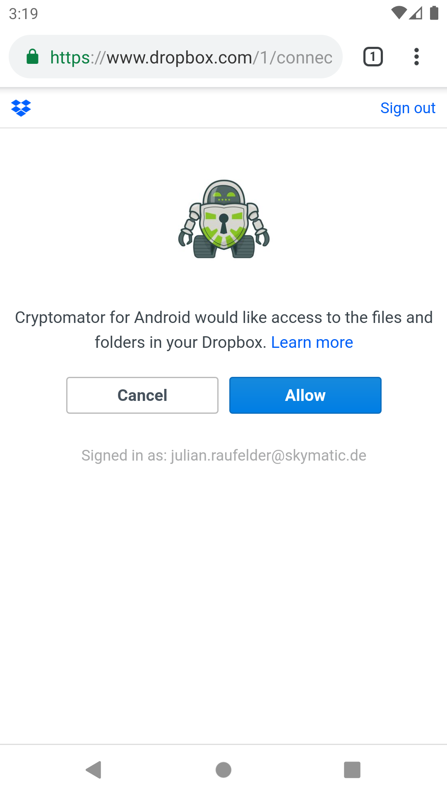

## Login Google Drive

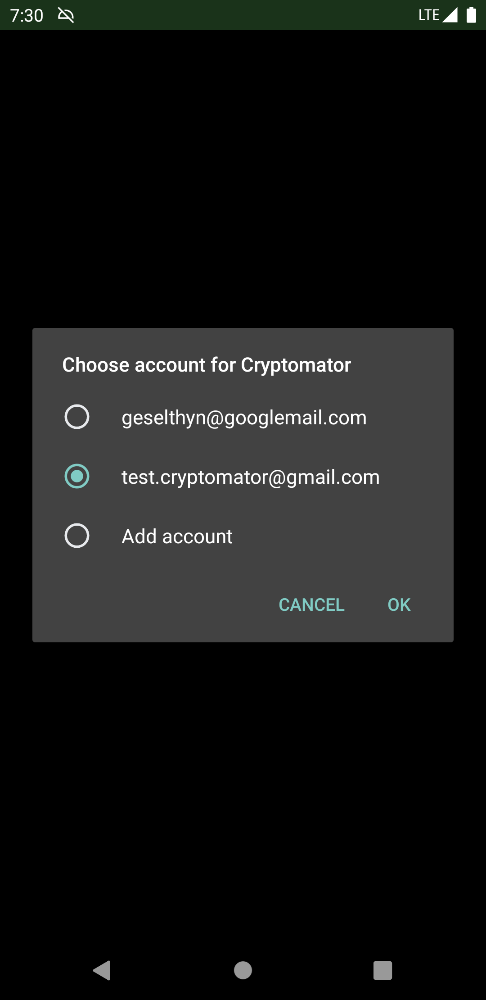

## Login OneDrive

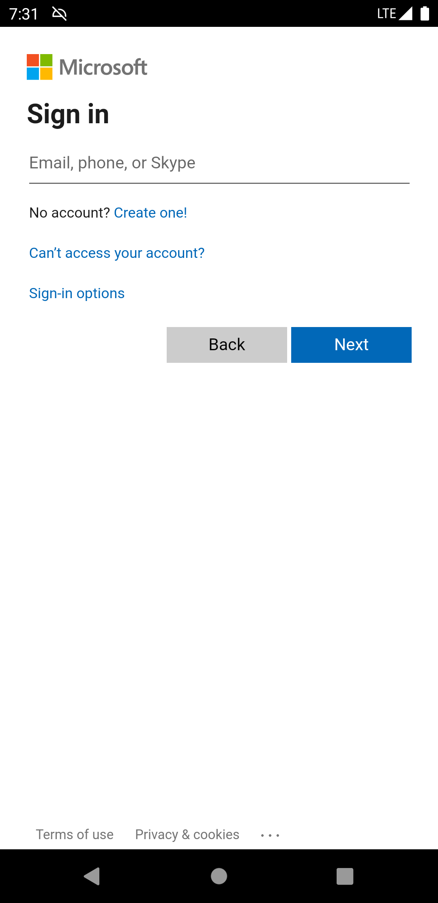

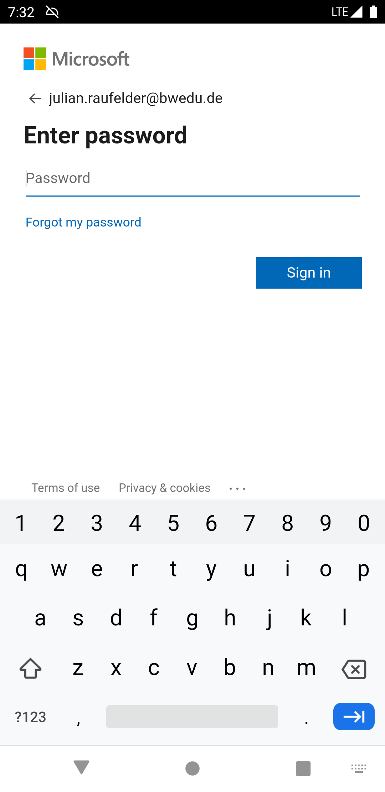

## Login WebDAV

Please see [a non-exhaustive list of Cloud Services](../../misc/supported-cloud-services#clouds-with-webdav-support) and information about accessing them with WebDAV.

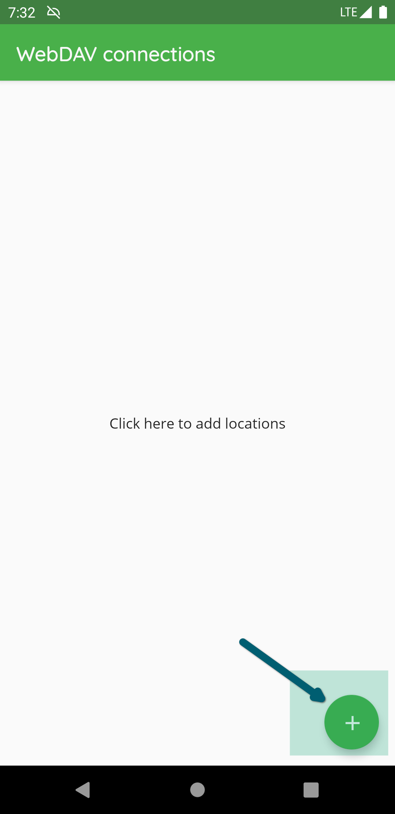

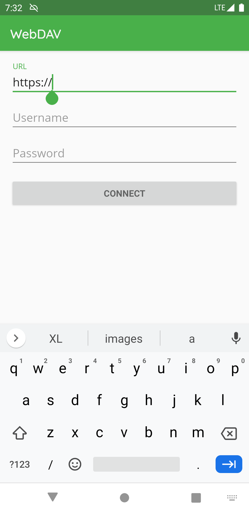

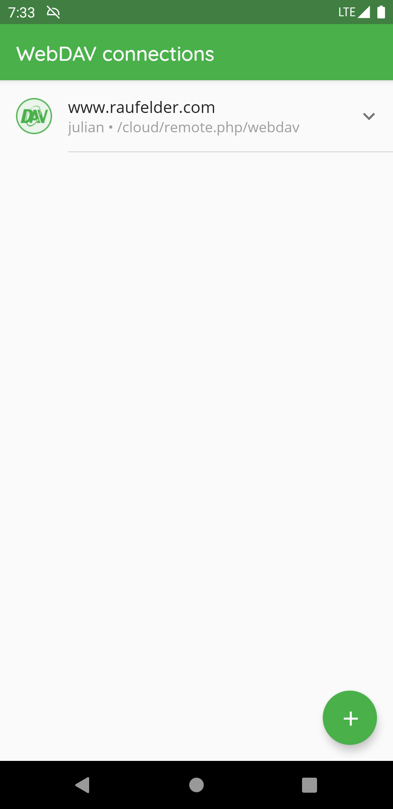

:::note
While creating the WebDAV connection, please make sure to add the root of the accessible storage and don't navigate directly into the vault.
:::

## Login S3

Generate a key that has permissions "Allow List All Bucket Names". (AWS root users have this by default and [this permission may not be necessary in the future](https://github.com/cryptomator/android/issues/339).)

"endpoint" refers to how the S3 API for your bucket can be reached. In the case of [official S3](https://docs.aws.amazon.com/general/latest/gr/s3.html), it would be `s3.<region>.amazonaws.com`, for e.g. [Backblaze B2](https://www.backblaze.com/apidocs/introduction-to-the-s3-compatible-api) `s3.<region>.backblazeb2.com`.

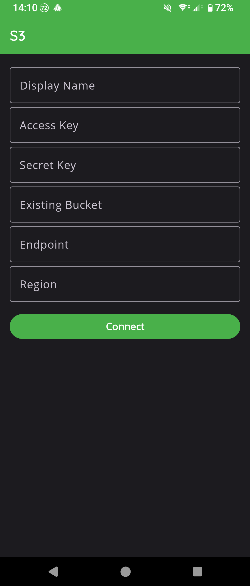

## Login Local Storage

The following pictures describes how to setup a location to access vaults stored on the internal storage of the device (the same applies for vaults located e.g. on a SD card):

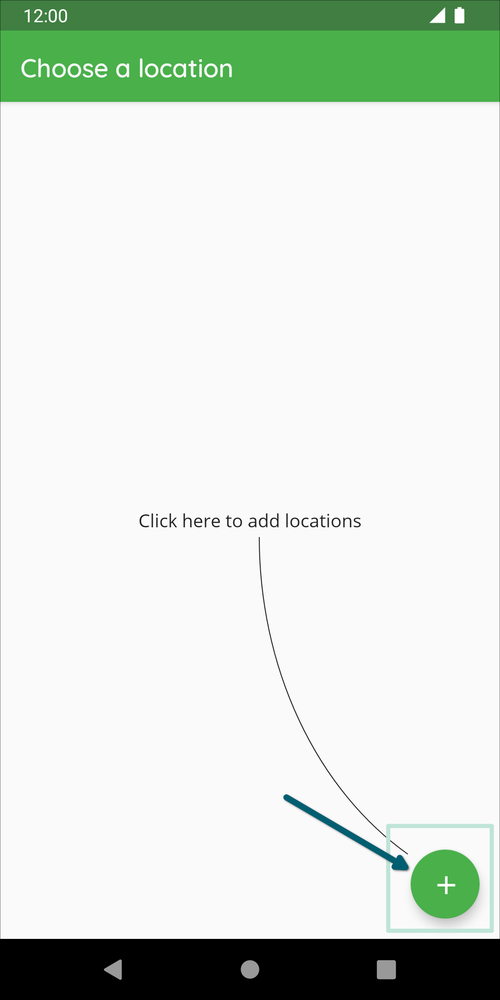

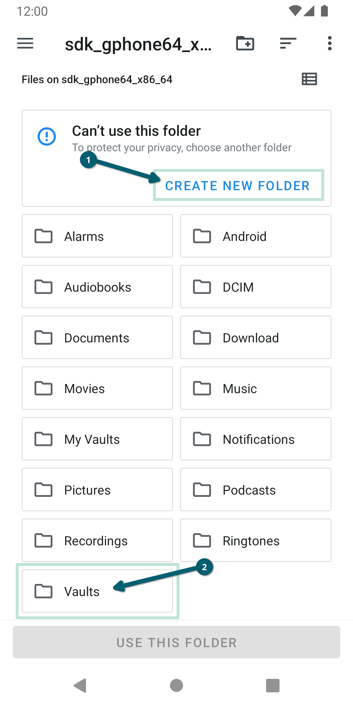

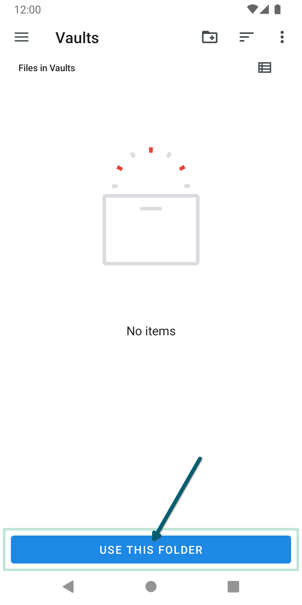

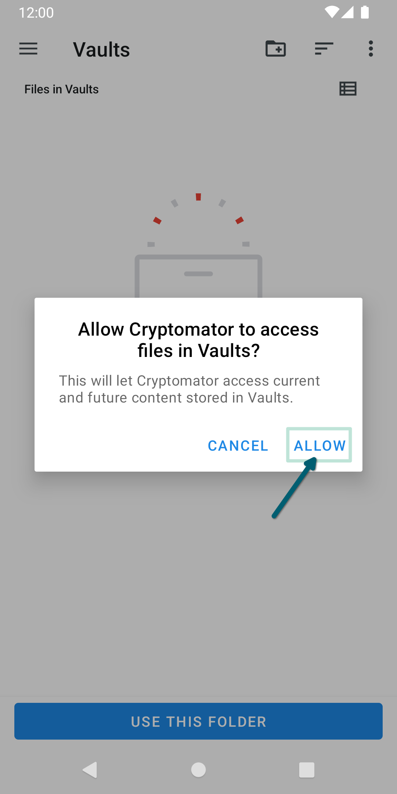

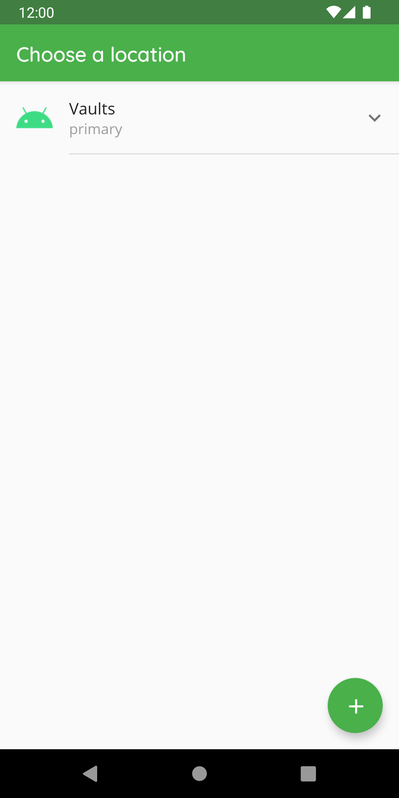

After creating the location, you can access it by clicking on the name of the location to add a vault or create a new vault.

:::note
If you use a custom location please make sure to add the root folder of the storage like described in the pictures and don't navigate directly into the vault.
:::
