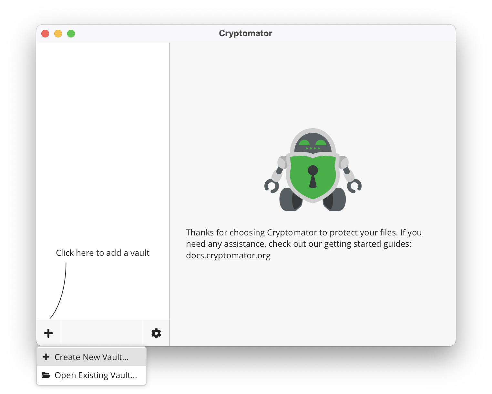
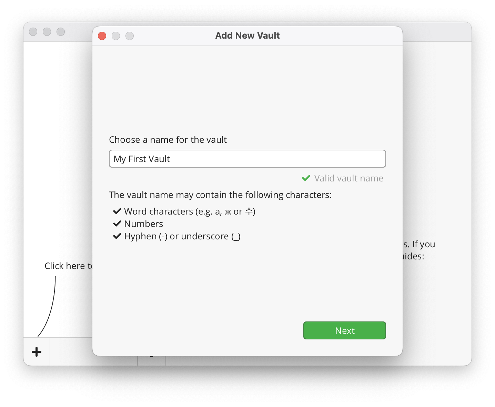
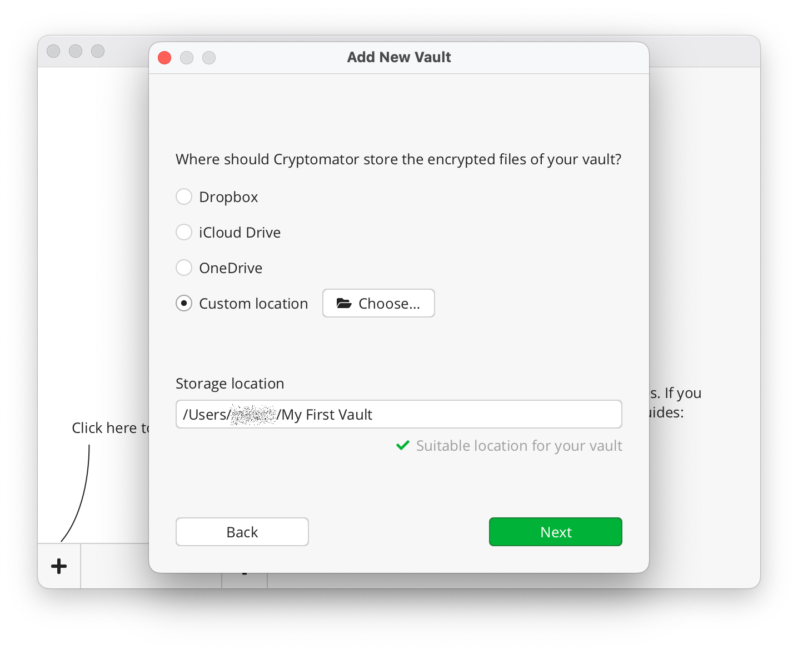
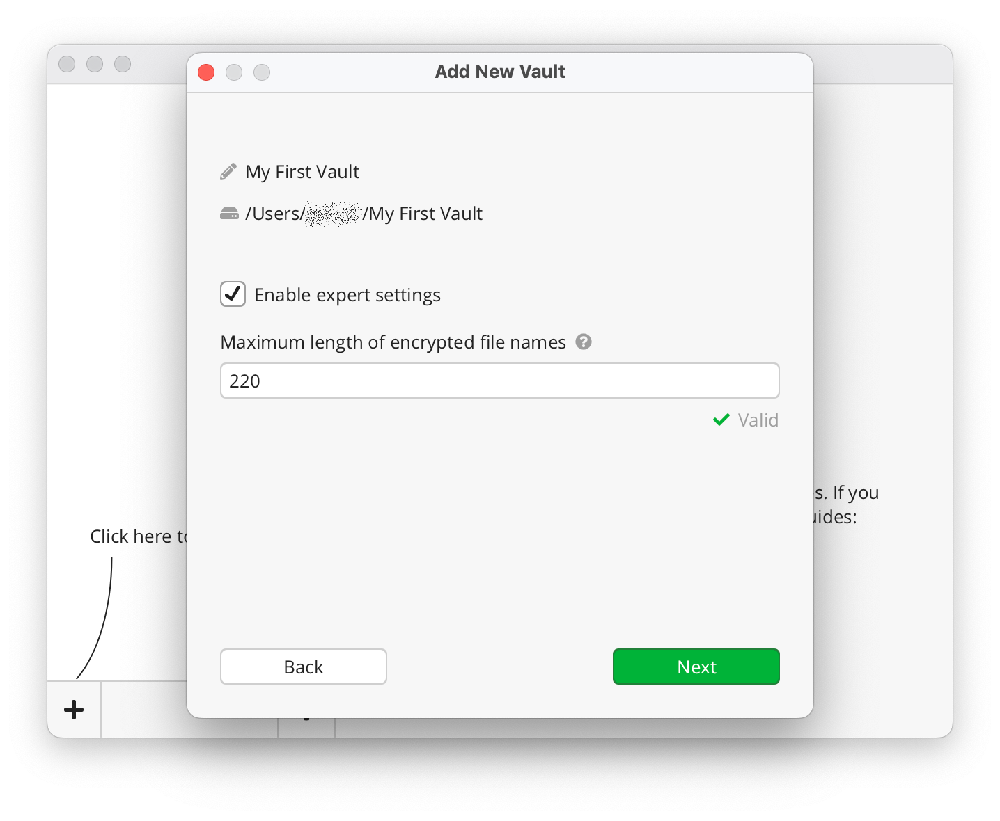
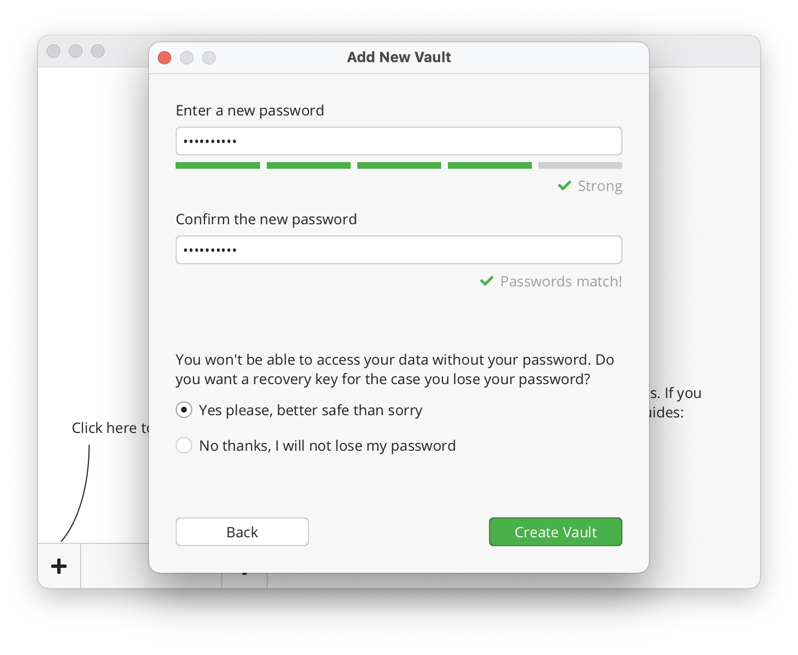
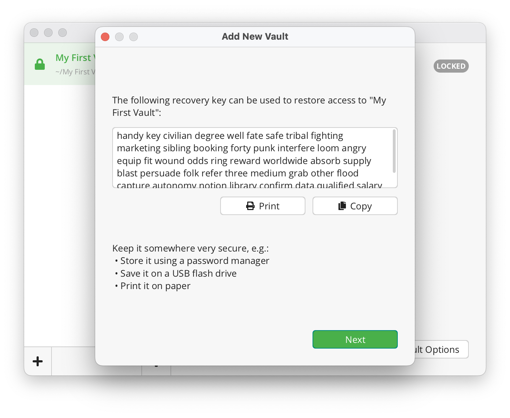
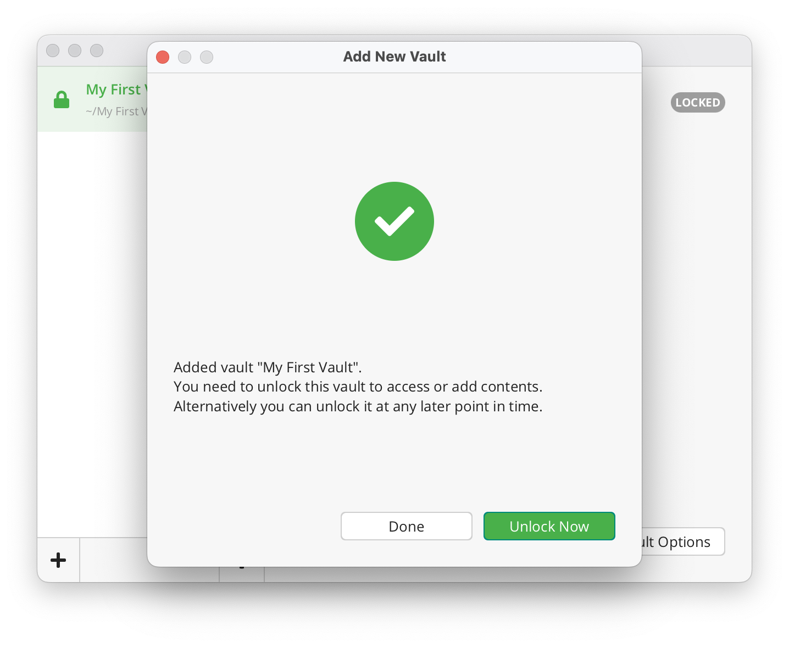

# Adding Vaults

You will be presented with two options when adding a vault:

1. **Create New Vault...** - Choose this if you wish to create a new vault.
2. **Open Existing Vault...** - Choose this if you already have a vault and wish to open it.

## Create a New Vault

If you chose to create a new vault, the wizard will guide you through a simple 6-step vault creation process.

### 1. Choose a Name

Start by choosing a name for your vault.

### 2. Choose a Storage Location

Next, you need to choose a directory on your PC where your vault's encrypted data will be stored.
If you wish to sync the encrypted data to your cloud storage, then choose a cloud-synced directory.

Cryptomator is not a sync tool.
You need to install the sync software of your cloud storage provider to sync your encrypted data.

:::note
Cryptomator tries to detect locations of well-known cloud sync software (see screenshot below).

The screenshot below shows multiple cloud storage locations, because we have multiple sync software installed on our device.
You might not see the same options, depending on which cloud services are installed on your PC, but you can always choose `Custom Location` and navigate to your cloud-synced directory manually.
:::

### 3. Expert Settings

The **Expert Settings** screen provides advanced configuration options for your vault. These settings are intended for users who require greater control over how their data is encrypted and stored.

:::note
Expert Settings are optional and should only be adjusted if you understand their implications.
:::

**Enable Expert Settings**

To access expert settings, toggle the **Enable Expert Settings** switch. Once enabled, additional configuration options will be available.

**Maximum Length of Encrypted File Names**

One of the primary expert settings allows you to configure the maximum length of encrypted file names. This setting controls the degree of *name shortening* applied to file names during encryption, which is critical for compatibility with filesystems that have strict length limits.

- **Default Behavior**: Cryptomator automatically shortens file names to comply with filesystem constraints.
- **Custom Configuration**: If specific requirements must be met, you can manually set the maximum allowed length for encrypted file names.

Refer to [Name Shortening](../../security/vault#name-shortening) for additional details. 

:::warning
Adjusting the maximum length of encrypted file names may affect compatibility with certain filesystems. Ensure you thoroughly test these settings before enabling them for critical data.
:::

### 4. Choose a Password

Now it is time to choose a [strong password](../../security/best-practices#good-passwords) for your vault.
Cryptomator requires at least 8 characters, but we recommend you to use longer phrases such as pass-sentences.
The bar below the password field will help you estimate the strength of your password.

:::note
Always choose a password that's unique across your vaults and accounts.
This is especially important if you plan to share a vault with someone.
Additionally, we recommend sharing passwords only over a secure channel, like PGP encypted emails, or end-to-end encrypted chat apps.
:::

:::warning
Nobody except you knows this password, and we also cannot "reset" it for you. 
Without a valid password, your files can't be decrypted and will become inaccessible. 
So, store your password in a secure password manager or just don't forget it. 

However, you can reset a vault's password by yourself if you have its *recovery key*.
:::

### 5. Show Recovery Key (optional step)

A recovery key allows you to reset your password if you ever forget it.

If you chose to create a recovery key in the previous step, it will now be displayed.
Make sure not to lose it and ideally make a hard copy of it.

:::warning
Remember, a recovery key is just like your password, its purpose is to gain access to your vault!
Keep it as safe as your password.
:::

For more details, take a look at [how a recovery key works](password-and-recovery-key.md#reset-password).

### 6. Done

That's it.
You have successfully created a new vault.

You can now unlock this vault using your password and start adding files into it.

## Open an Existing Vault

To open an existing vault, you need to locate the `masterkey.cryptomator` file of the vault you wish to open.

:::note
If you created the vault on another device and cannot find it or its masterkey file, make sure that the directory containing the vault is properly synchronized and fully accessible on your device.
:::
