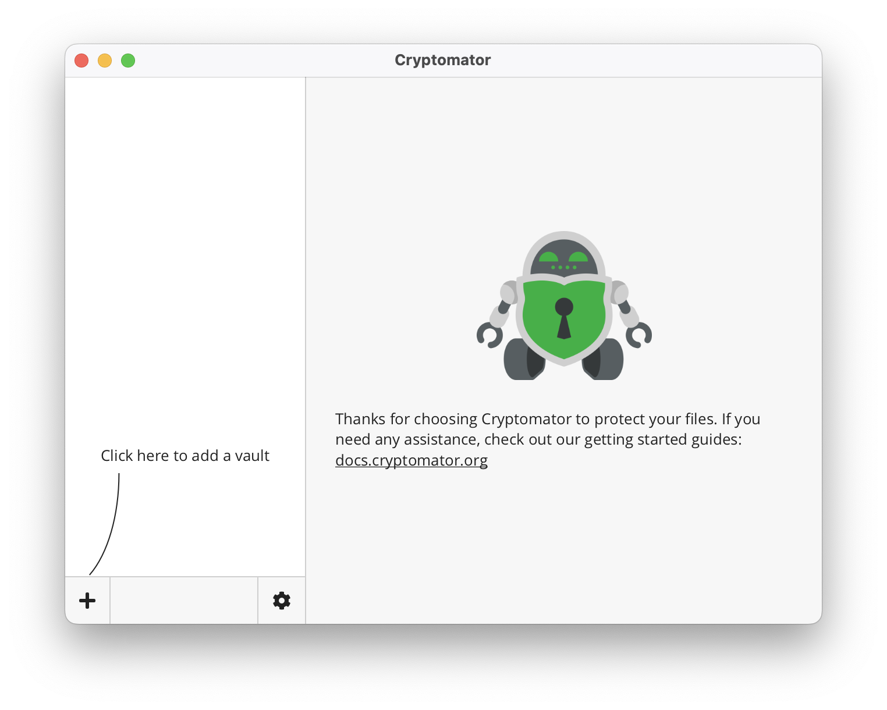

# Getting Started

You will be greeted with the following screen when you start Cryptomator for the first time. 
You can create new vaults (or add existing ones) using the [**+**](adding-vaults.md) button located at the lower left corner.

<!-- Tutorial Video
## Tutorial Video

-->
