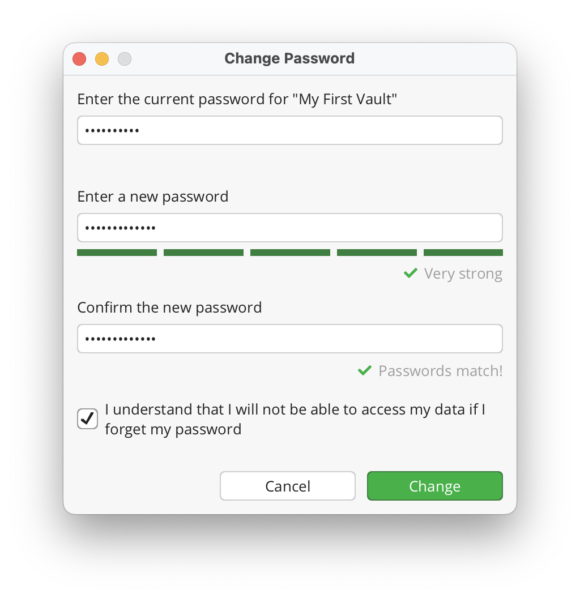
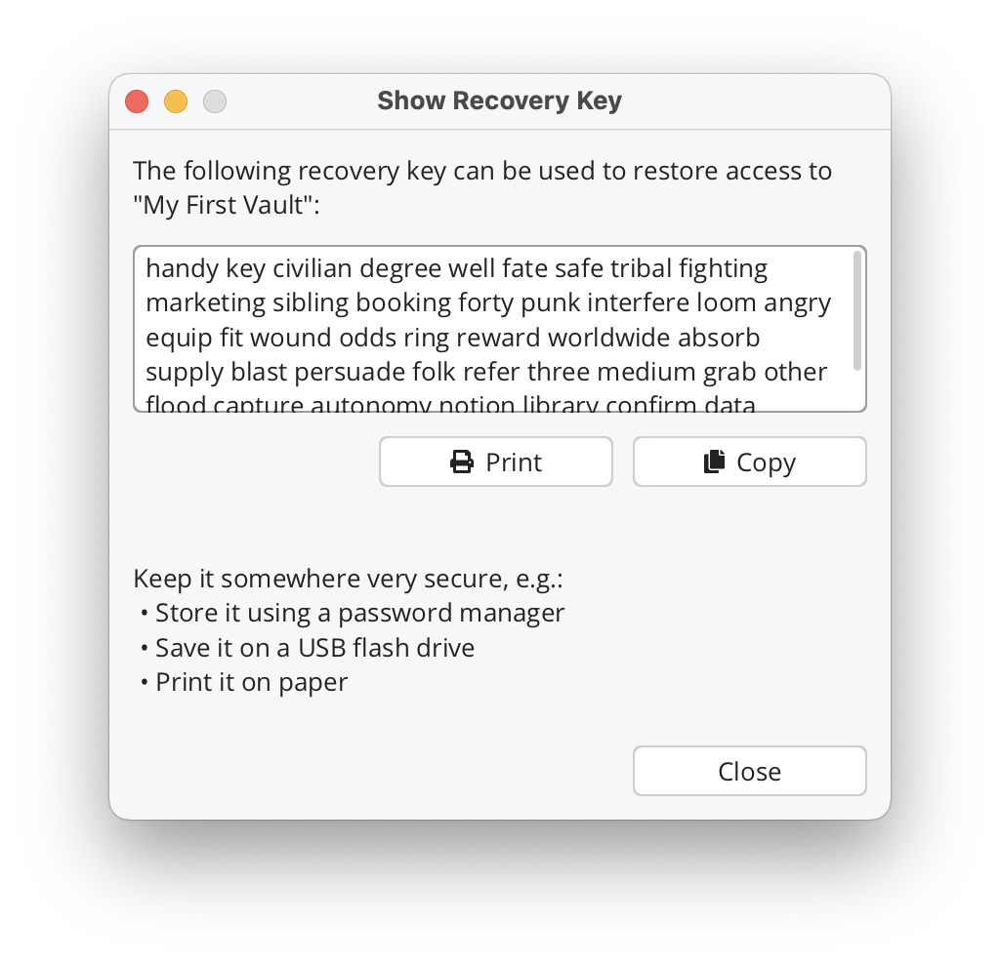
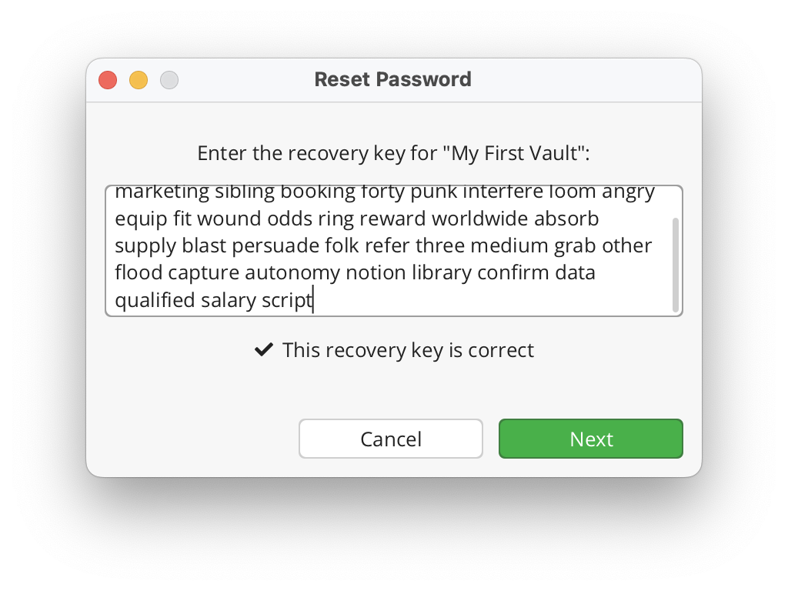

# Password And Recovery Key

This section explains how to change a password for a vault, show its recovery key, and reset a password.
But, before that, let's understand how Cryptomator encrypts a vault using a password and what a recovery key is.
The security of your vault is only as good as its password because Cryptomator encrypts your vault using a key derived from your password.
So, [choosing a strong password](../../security/best-practices.md#good-passwords) is very important.

Additionally, a unique *recovery key* can be derived for each vault while creating its password or later.
A *recovery key* allows you to create a new password if you forget the original one.
Do note that the *recovery key* feature does not break encryption in any way.
It is a human readable form of your decrypted [masterkey](../../security/architecture.md#masterkey) and therefore independent of the current vault password and highly confidential.
Keep it as safe as your password.

All actions can be carried out using the `Password` tab under vault options.
You can access it by selecting a vault, lock it if necessary, and click on `Vault Options`.

## Change Password

To change the password of an existing vault, you need to know its current one or have a recovery key (see reset password section).

Navigate to the `Vault Options` -> `Password` tab, and click on `Change Password`.

In the opened window, you will be asked for:

1. The vault's current password.
2. A new password. We suggest following our guide on choosing a [strong password](../../security/best-practices.md#good-passwords).
3. Enter the new password again.

In order to proceed, you must confirm that you understand your action by selecting a checkbox.

Finally, click on the `Change` button to change the password.

:::note
The `Change` button is activated only if the new password fields match and the checkbox is selected.
:::

:::note
The password is used to derive a [KEK](https://en.wikipedia.org/wiki/Glossary_of_cryptographic_keys), which is then used to encrypt further keys. The KEK changes, but the keys encrypted with the KEK will stay the same. The actual files will not get re-encrypted, meaning you can not upgrade a weak passphrase to a stronger one once the data has been synced to a service that allows recovery of older versions of the masterkey file.

If you like to encrypt your vault files with a new, stronger password, you need to create a new vault and drag the data from the old to the new one. Make sure to wipe all backups of the old vault afterwards.

:::

## Show Recovery Key

You can derive a recovery key during vault creation or even later as long as you know your vault's password.
To increase security, Cryptomator does not store the recovery key on your hard drive and always derives it on the fly.

:::warning
A recovery key can reset a vault's current password. 
So, treat it like a password and ensure only trusted people have access to it.

:::

To derive a recovery key:

1. Navigate to the `Password` tab under `Vault Options`.
2. Click on `Display Recovery Key`.
3. Enter the vault's password.

A new window will open displaying a sequence of words (i.e., the recovery key).

You can copy it to your clipboard and store it in a secure password manager, or print it on paper.

## Reset Password

We cannot reset the password of a vault for you in any way. Only you can reset a vault's password, assuming you have its recovery key. Keep it ready before you proceed.

1. Navigate to the `Password` tab under `Vault Options`.
2. Click on `Recover Password`.

Type or paste your recovery key in the new window.

:::note
Cryptomator offers an auto completion feature to make things easier when typing a recovery key. It's helpful if your recovery key is printed on paper or stored it somewhere where you cannot copy it. The feature will kick in automatically once you start typing the first few letters of a word.

:::

If the recovery key is valid, a small message will be displayed below the entered recovery key and the `Next` button will be activated.

:::warning
By design, *only* the correct recovery key is accepted. **A valid but incorrect key won't be accepted to prevent your old data from becoming inaccessible.**

:::

Finally, assign a new password to your vault.
It is the same process as the [vault creation](adding-vaults.md#4-choose-a-password), except that no new recovery key is generated.
Again, please choose a [strong password](../../security/best-practices.md#good-passwords).

Once changed, you can unlock your vault with the new password.

:::note
Don't discard the recovery key after resetting the password as it will still remain valid.

:::
