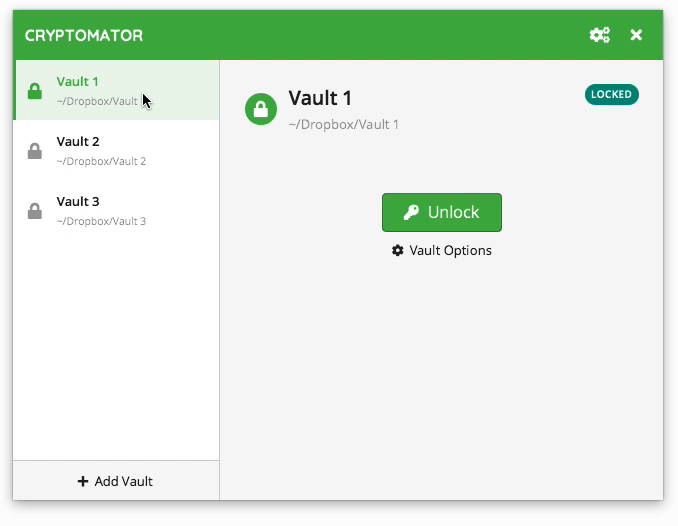
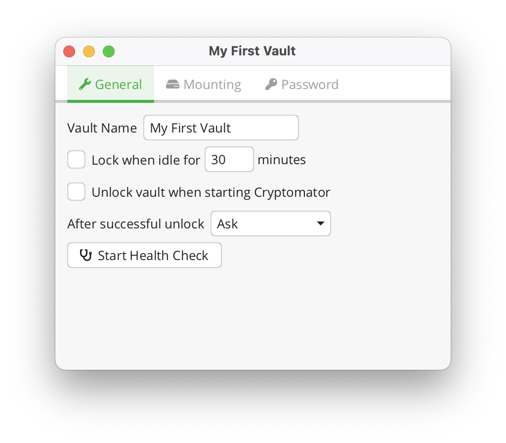
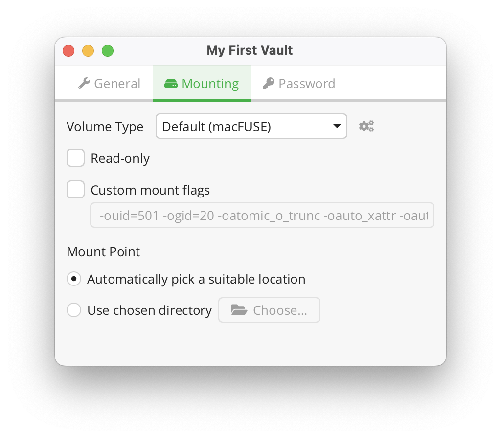
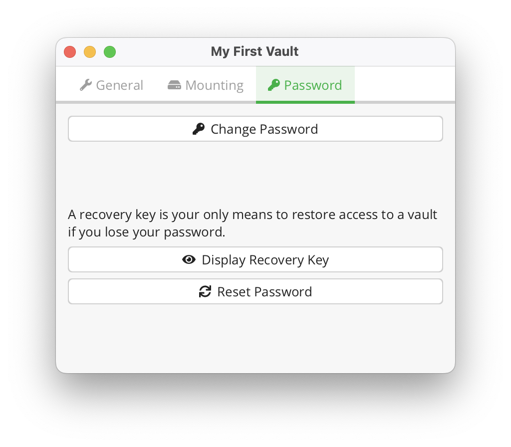

# Vault Management

A *vault* is where your files are stored encrypted.
For your operating system or other apps, a vault is a just a normal directory containing some encrypted files.
Only Cryptomator can decrypt the vault's contents when you unlock it using a password.

## Remove Vaults

To remove a vault from the vault list, right click on a vault, and click remove. 
This is only possible if the vault is locked.

:::note
The vault is **not** deleted from your PC by removing it from the list. If you wish to permanently delete your encrypted files, you need to delete the vault directory using the file manager.

:::

## Reorder Vaults

You can change the order of the vaults in the list by dragging them.

## Vault Options

Each vault has its own settings which can be customized under vault options.
To open a vault's settings, select a vault, lock it, and click on `Vault Options`.

The options are divided across three categories:

1. General - Options not fitting in other categories.

You can select this option if the vault is unlocked as soon as Cryptomator starts.

2. Mounting - Settings that manage how and where a vault is mounted.

:::note
The mount options depend on the selected [volume type](volume-type.md#general-volume-type-selection).
:::

3. Password - Here you can manage the vault's password and recovery key.

Take a look at the [Volume Type](volume-type.md) and [Password And Recovery Key](password-and-recovery-key.md) sections to understand how vault mounting and passwords work.
